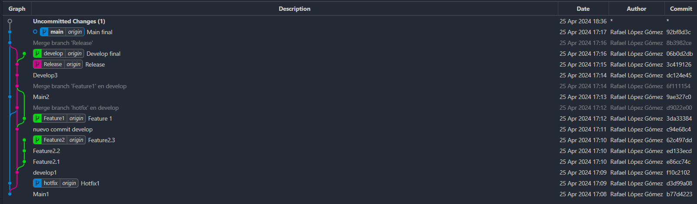

# COMANDOS
- Para crear ramas he usado el comando "create branch"

- Para registrar los cambios he utilizado el comando "commit" con un mensaje informativo sobre los cambios que he realizado

- Para subir los commits he usado el comando "push"

- Y para combinar ramas he usado el comando "merge"

